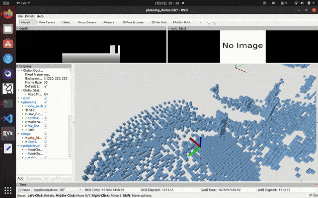

# UAPE_planner 2.0: Uncertainty-Aware and Perception-Enhanced trajectory planning for dynamic environments

Safe flight corridor is not required any more.

Demo:

 

It depends on [mlmapping](https://github.com/chenhanpolyu/MLMapping) and [px4Controller](https://github.com/ZJU-FAST-Lab/Fast-Drone-250/tree/master/src/realflight_modules/px4ctrl) two packages, please clone them and compile them in your workspace first.

Compile all required package and source your workspace.

To begin the navigation in Gazebo simulation, you also need to build up your own Gazebo simulation world with a PX4 drone and d435 depth camera first. You can try [this repo](https://github.com/HKPolyU-UAV/E2ES) to access a simulation environment quickly.

To launch the navigaton task, run:

`roslaunch uape_planner_2 sim_traj_node.launch`

The goal is set in `planning_params.yaml`, after the drone reached the goal, you can manually terminate the program and set another goal, save the yaml file, restart the navigation.

Set `ReturnHome` to a number greater than 2 to activate the repeating mode. The number indicates the number of navigations. For example, "4" means fly to goal (1 navigation), return home (2 navigation), fly to goal again (3 navigation), return home again (4 navigation).

Set if_RandomGoal to true to activate the randomly fly mode. The drone will choose the next goal randomly inside the global bounding box (see parameter `GlobalBox_min`, `GlobalBox_size`). It is usaully used in simulation. Please set it to false if you want to use other modes.

You can set `ifMove` to false to check the planned trajectory without the drone move its position, the drone will hover at its original position.

`VelMax` is the upper speed limitation of the planned trajectory. `ThrustAccMax` is for the thrust acceleration (total thrust force/total vehicle mass), and please set it according to your actual dynamic limit (usually not greater than 20). It must be greater than 10 (G).
